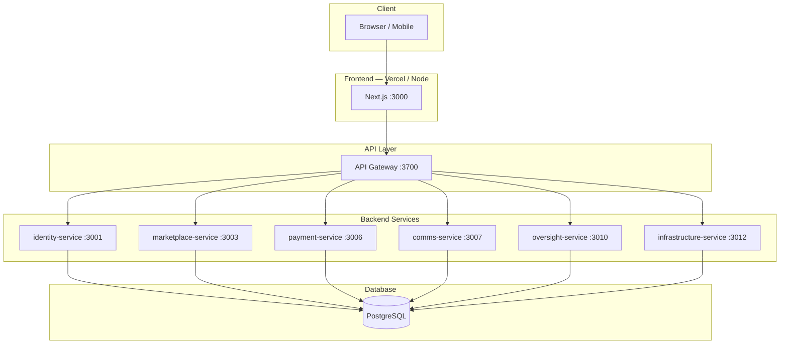
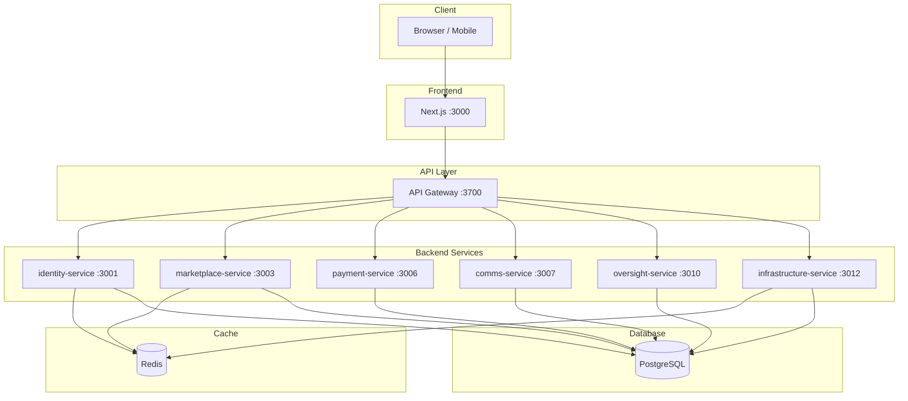
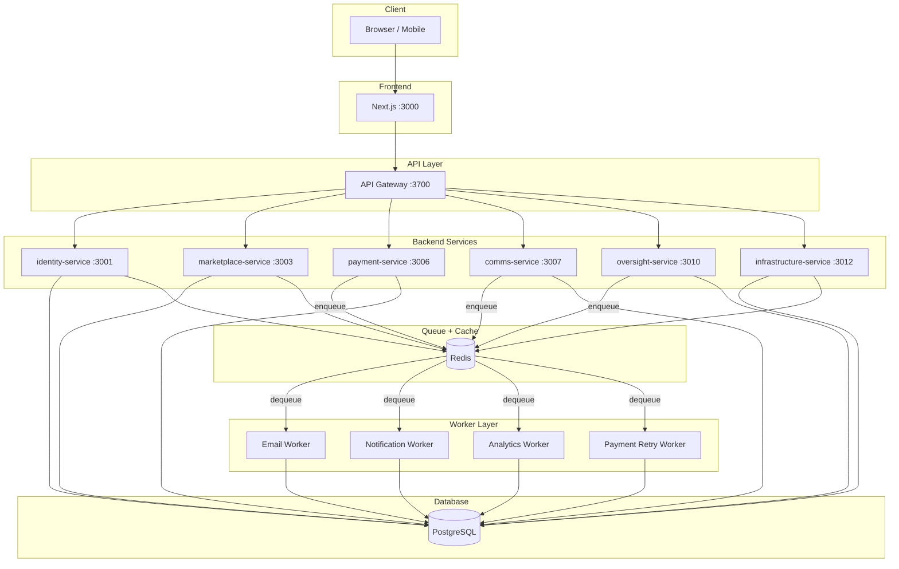
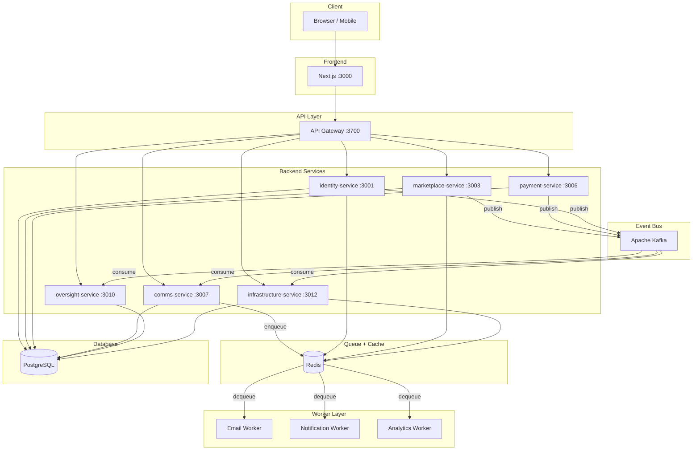
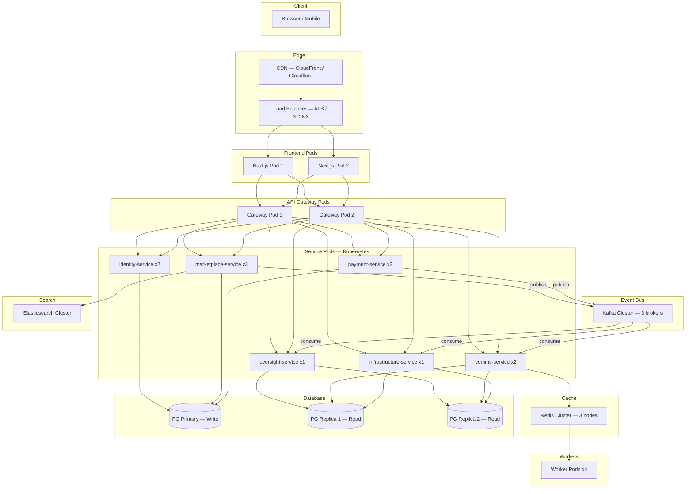
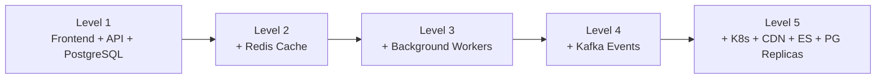

# System Architecture Diagrams

This document provides **visual architecture diagrams for all 5 scaling levels** of the Local Service Marketplace.

**Core Principle**: The application code remains unchanged across all levels. Only the infrastructure beneath it evolves. Database schema stays stable. Services are the same — only their backing infrastructure grows.

---

## Level 1 — Pure MVP (No Redis, No Kafka, No Elasticsearch)

**Goal**: Launch fast with the simplest possible stack.

**Stack**: Next.js + API Gateway + NestJS Services + PostgreSQL. Nothing else.

**What happens at Level 1:**

| Concern | How it's handled |
|---------|-----------------|
| Caching | None — all reads hit PostgreSQL directly |
| Rate limiting | In-memory (per-process) |
| Background jobs | Synchronous — run inline in API handlers |
| Notifications | Direct HTTP calls to email/SMS services |
| Events | Stored in `events` table only (no bus) |
| Search | SQL `LIKE` / `ILIKE` queries |

**Capacity**: 200–350 concurrent users

---

## Level 2 — Add Redis Cache

**Goal**: Reduce database load for frequently accessed data.

**New component**: Redis (single instance)

**What changes:**

| Concern | Level 1 | Level 2 |
|---------|---------|---------|
| Caching | None | Redis (categories, profiles, feature flags) |
| Rate limiting | In-memory | Redis-backed (distributed) |
| Sessions | DB-stored | Redis session store |

**Capacity**: 500–1,000 concurrent users

---

## Level 3 — Add Background Workers

**Goal**: Move heavy, slow tasks out of API request handlers.

**New component**: Redis-backed job queues + Worker processes

**Worker tasks:**
- Send emails and SMS
- Deliver push notifications
- Aggregate analytics / daily metrics
- Retry failed payments
- Generate reports

**Capacity**: 2,000+ concurrent users

---

## Level 4 — Add Kafka Event Streaming

**Goal**: Decouple services. Enable real-time event-driven communication.

**New component**: Apache Kafka

**Event topics:**

| Event | Producer | Consumers |
|-------|----------|-----------|
| `request_created` | marketplace-service | comms-service, oversight-service |
| `proposal_submitted` | marketplace-service | comms-service |
| `job_started` | marketplace-service | payment-service, comms-service |
| `payment_completed` | payment-service | marketplace-service, comms-service |
| `review_submitted` | marketplace-service | oversight-service |
| `user_registered` | identity-service | comms-service, oversight-service |

**Capacity**: 10,000+ concurrent users

---

## Level 5 — Distributed Platform (Kubernetes)

**Goal**: Enterprise-grade scale, high availability, fault tolerance.

**New components**: Kubernetes, CDN, Redis Cluster, PostgreSQL read replicas, Elasticsearch

**Level 5 additions:**

| Component | Purpose |
|-----------|---------|
| CDN | Static assets, edge caching |
| Load Balancer | Distribute traffic across gateway pods |
| Kubernetes | Auto-scaling, health checks, rolling deploys |
| Redis Cluster | Distributed cache, no single point of failure |
| PG Replicas | Read replicas for analytics & read-heavy queries |
| Elasticsearch | Full-text search, provider discovery, autocomplete |

**Capacity**: 50,000+ concurrent users

---

## Infrastructure Evolution Summary

| Level | Components Added | Capacity |
|-------|-----------------|----------|
| 1 | Frontend, API Gateway, 6 NestJS services, PostgreSQL | 200–350 users |
| 2 | + Redis (cache, rate limiting, sessions) | 500–1,000 users |
| 3 | + Redis queues + Worker processes | 2,000+ users |
| 4 | + Apache Kafka event bus | 10,000+ users |
| 5 | + Kubernetes, CDN, Redis Cluster, PG replicas, Elasticsearch | 50,000+ users |

---

## Key Architecture Principles

1. **Code stays the same** — Services don't change between levels. Only infrastructure config changes.
2. **Infrastructure is optional** — Redis, Kafka, and Elasticsearch are enabled via env vars (`REDIS_URL`, `EVENT_BUS_ENABLED`, etc.). If not configured, services fall back to in-memory or direct DB queries.
3. **Database schema is stable** — The same `schema.sql` works at every level.
4. **Each service owns its tables** — No cross-service database joins at any level.
5. **Graceful degradation** — If Redis goes down, services continue (slower). If Kafka is down, events are stored in the `events` table for replay.

---

_End of System Architecture Diagrams_
